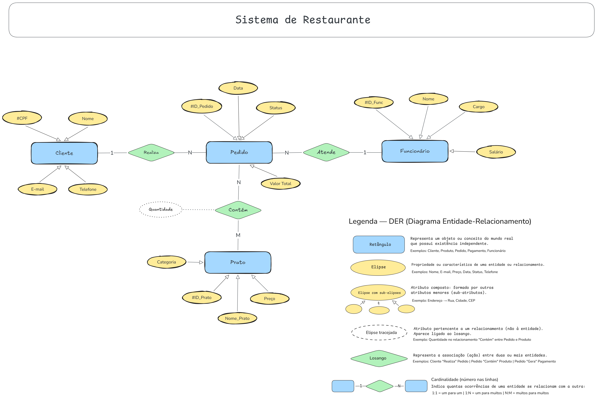

# 🍽️ Sistema de Gerenciamento de Restaurante

Este projeto consiste em um sistema para gestão de operações de um restaurante, abrangendo desde o cadastro de clientes e funcionários até o controle de pedidos e pratos. O foco principal desta etapa é a modelagem de dados através do **Diagrama Entidade-Relacionamento (DER)**.

---

## Estrutura das Entidades

O sistema é composto por quatro entidades principais:

### 1. Cliente

- **Atributos:** CPF (Identificador), Nome, E-mail, Telefone.
- **Relacionamento:** Realiza **pedidos** (1:N).

### 2. Funcionário

- **Atributos:** ID_Func (Identificador), Nome, Cargo, Salário.
- **Relacionamento:** Atende **pedidos** (1:N).

### 3. Pedido

- **Atributos:** ID_Pedido (Identificador), Data, Status, Valor Total.
- **Relacionamento:** Contém **pratos** (N:M).
- **Atributo de Relacionamento:** Quantidade.

### 4. Prato

- **Atributos:** ID_Prato (Identificador), Nome Prato, Preço, Categoria.

---

## Tecnologias Usadas

- **Linguagem:** Java 21
- **Framework:** Spring Boot
- **Banco de Dados:** MySQL ou PostgreSQL
- **Gerenciador:** Maven

---

## Modelagem de Dados (DER)

<div align="center">
  
  <p><i>Representação visual da estrutura do banco de dados</i></p>
</div>

---

## Instalação e Execução

### 1. Pré-requisitos

- Java JDK 21
- Maven
- Git
- MySQL rodando localmente

### 2. Clonar o Repositório

```bash
git clone [https://github.com/iscaio/RestauranteAPI](https://github.com/iscaio/RestauranteAPI)
cd RestauranteAPI
```

---

### 3. Configuração do Banco de Dados (MySQL)

Antes de rodar a aplicação, você precisa preparar o banco de dados:

Acesse seu MySQL e crie o schema:

```bash
CREATE DATABASE restaurante_db;
```

---

## Configure seu "application.properties"

Credenciais de Conexão MySQL

```
spring.datasource.url=jdbc:mysql://localhost:3306/restaurante_db
spring.datasource.username=seu_usuario
spring.datasource.password=sua_senha
```

Configurações do Hibernate/JPA

```
spring.jpa.hibernate.ddl-auto=update
spring.jpa.show-sql=true
spring.jpa.properties.hibernate.dialect=org.hibernate.dialect.MySQLDialect
```

---

## 4. Execução do Projeto

Com o banco configurado, utilize o Maven no terminal para compilar e rodar:

```
# Limpar versões anteriores e instalar dependências
mvn clean install

# Iniciar a aplicação Spring Boot
mvn spring-boot:run
```

---

```
A API estará disponível e pronta para receber requisições em: http://localhost:8080
```

---
